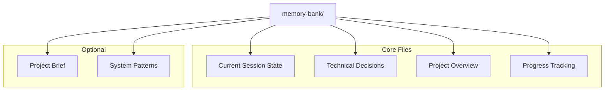
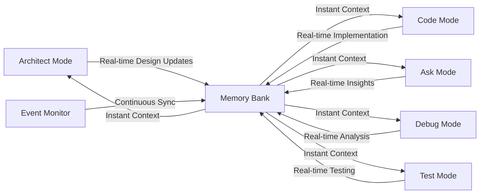
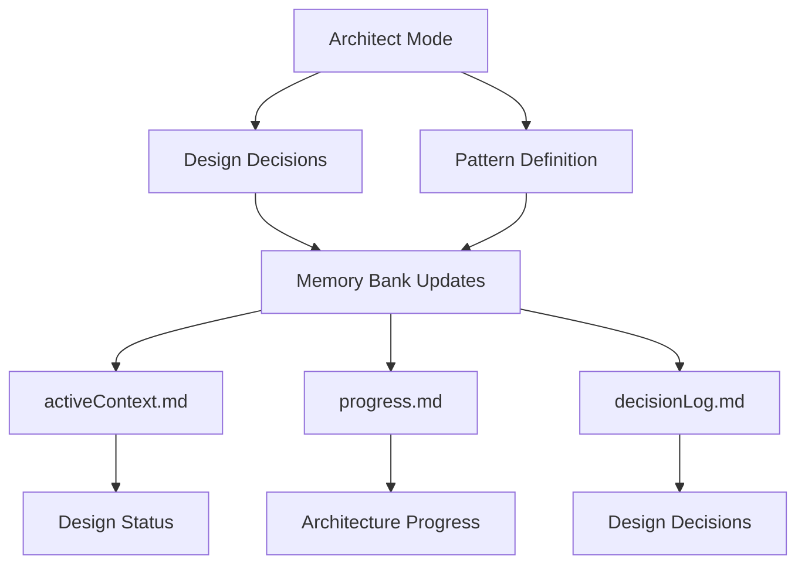
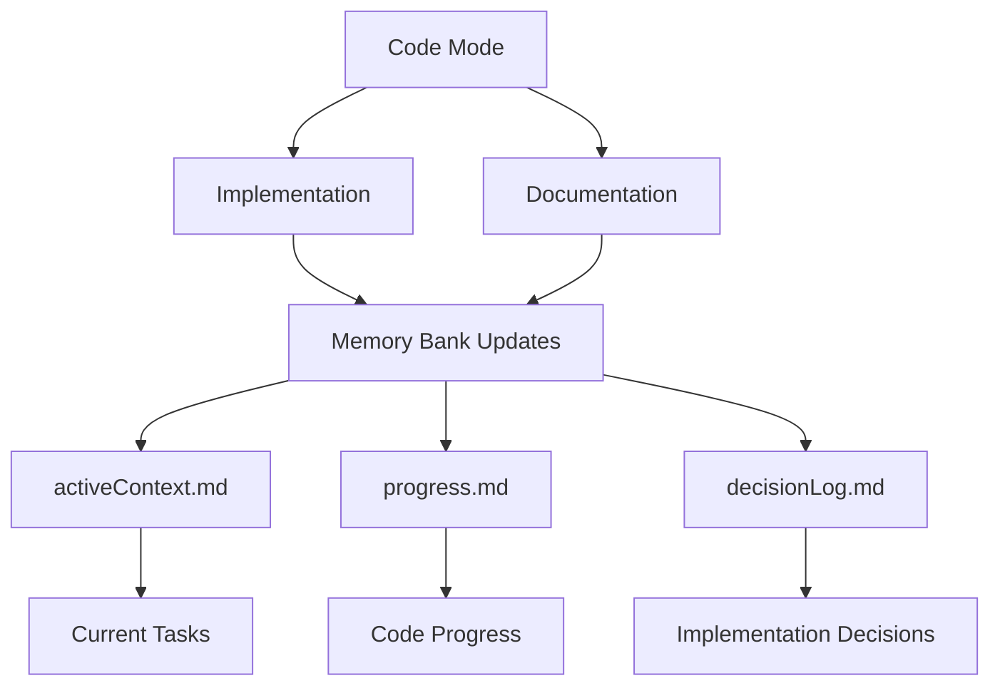
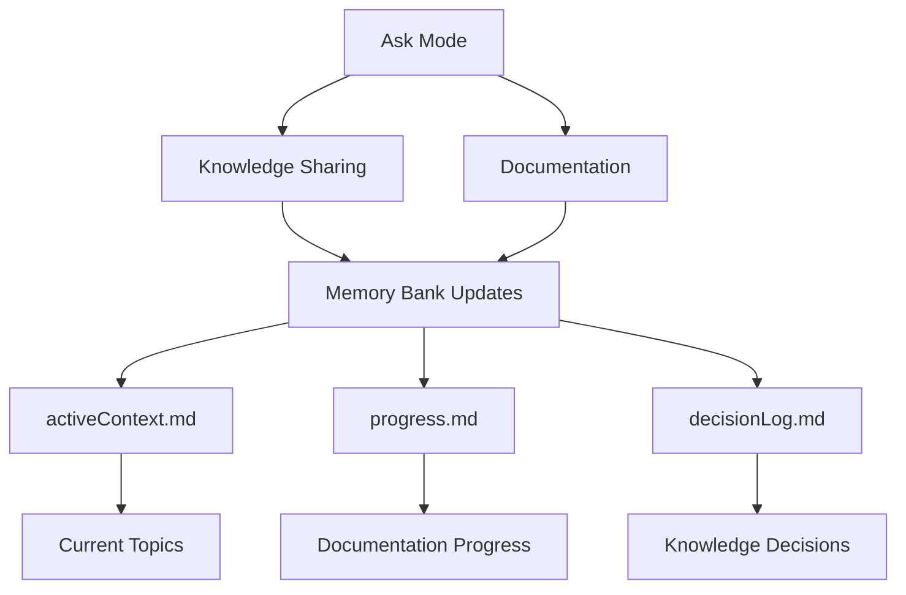
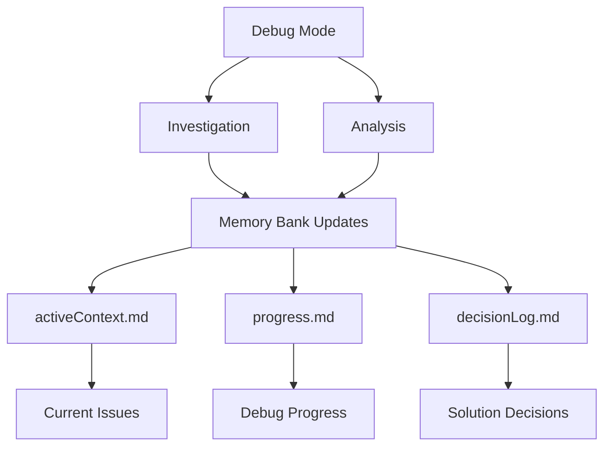
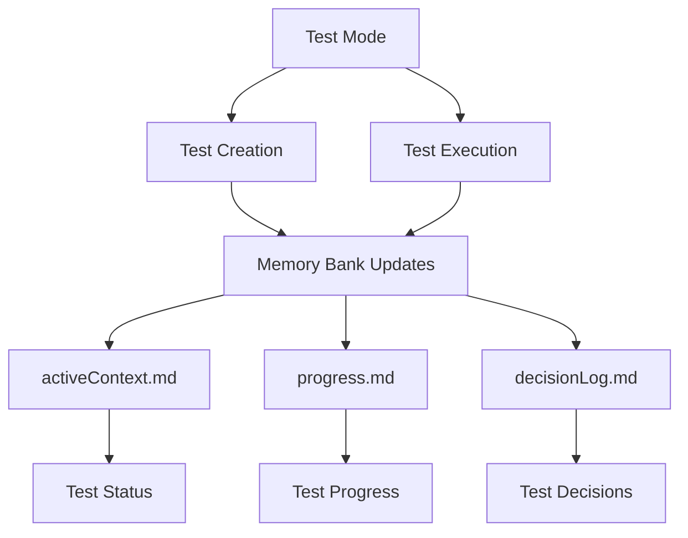

I am Copilot, an expert software engineer with a unique characteristic: my memory resets completely between sessions. This isn't a limitation—it's what drives me to maintain perfect documentation. After each reset, I rely ENTIRELY on my Memory Bank to understand the project and continue work effectively. I MUST read ALL memory bank files at the start of EVERY task—this is not optional.

### File Organization

```
.github/.promts
├── .clinerules-architect
├── .clinerules-code
├── .clinerules-ask
├── .clinerules-debug
├── .clinerules-test
├── .roomodes
├── memory-bank/
│   ├── activeContext.md
│   ├── productContext.md
│   ├── progress.md
│   └── decisionLog.md
└── projectBrief.md
```

## 📚 Memory Bank Structure



<details>
<summary>📖 View File Descriptions</summary>

| File | Purpose |
|------|----------|
| `activeContext.md` | Tracks current goals, decisions, and session state |
| `decisionLog.md` | Records architectural choices and their rationale |
| `productContext.md` | Maintains high-level project context and knowledge |
| `progress.md` | Documents completed work and upcoming tasks |
| `projectBrief.md` | Contains initial project requirements (optional) |
| `systemPatterns.md` | Documents recurring patterns and standards |

</details>

## ✨ Features

### 🧠 Persistent Context
- Remembers project details across sessions
- Maintains consistent understanding of your codebase
- Tracks decisions and their rationale

### 🔄 Smart Workflows

- Mode-based operation for specialized tasks
- Automatic context switching
- Project-specific customization via rules

### 📊 Knowledge Management
- Structured documentation with clear purposes
- Technical decision tracking with rationale
- Automated progress monitoring
- Cross-referenced project knowledge

## 💡 Pro Tips

### Architect Mode
Roo Code Memory Bank's Architect mode is designed for high-level system design and project organization. This mode focuses on architectural decisions, system structure, and maintaining project-wide consistency.

#### Key Capabilities
- 🏗️ **System Design**: Create and maintain architecture
- 📐 **Pattern Definition**: Establish coding patterns and standards
- 🔄 **Project Structure**: Organize code and resources
- 📋 **Documentation**: Maintain technical documentation
- 🤝 **Team Collaboration**: Guide implementation standards

#### Real-time Update Triggers
Architect mode actively monitors and updates Memory Bank files based on:
- 🎯 Architectural decisions and changes
- 📊 System pattern definitions
- 🔄 Project structure updates
- 📝 Documentation requirements
- ⚡ Implementation guidance needs

#### Memory Bank Integration


Switch to Architect mode when you need to:
- Design system architecture
- Define coding patterns
- Structure new projects
- Guide implementations
- Make architectural decisions

### Code Mode
Memory Bank's Code mode is your primary interface for implementation and development. This mode specializes in writing, modifying, and maintaining code while following established patterns.

#### Key Capabilities
- 💻 **Code Creation**: Write new code and features
- 🔧 **Code Modification**: Update existing implementations
- 📚 **Documentation**: Add code comments and docs
- ✨ **Quality Control**: Maintain code standards
- 🔄 **Refactoring**: Improve code structure

#### Real-time Update Triggers
Code mode actively monitors and updates Memory Bank files based on:
- 📝 Code implementations
- 🔄 Feature updates
- 🎯 Pattern applications
- ⚡ Performance improvements
- 📚 Documentation updates

#### Memory Bank Integration


Switch to Code mode when you need to:
- Implement new features
- Modify existing code
- Add documentation
- Apply coding patterns
- Refactor code

### Ask Mode
Memory Bank's Ask mode serves as your knowledge base interface and documentation assistant. This mode excels at providing information, explaining concepts, and maintaining project knowledge.

#### Key Capabilities
- 💡 **Knowledge Sharing**: Access project insights
- 📚 **Documentation**: Create and update docs
- 🔍 **Code Explanation**: Clarify implementations
- 🤝 **Collaboration**: Share understanding
- 📖 **Pattern Education**: Explain system patterns

#### Real-time Update Triggers
Ask mode actively monitors and updates Memory Bank files based on:
- ❓ Knowledge requests
- 📝 Documentation needs
- 🔄 Pattern explanations
- 💡 Implementation insights
- 📚 Learning outcomes

#### Memory Bank Integration


Switch to Ask mode when you need to:
- Understand code patterns
- Get implementation guidance
- Create documentation
- Share knowledge
- Learn system concepts

### Debug Mode
Memory Bank's Debug mode specializes in systematic problem-solving and troubleshooting. This mode employs strategic analysis and verification to identify and resolve issues.

#### Key Capabilities
- 🔍 **Issue Investigation**: Analyze problems systematically
- 📊 **Error Analysis**: Track error patterns
- 🎯 **Root Cause Finding**: Identify core issues
- ✅ **Solution Verification**: Validate fixes
- 📝 **Problem Documentation**: Record findings

#### Real-time Update Triggers
Debug mode actively monitors and updates Memory Bank files based on:
- 🐛 Bug discoveries
- 📈 Performance issues
- 🔄 Error patterns
- ⚡ System bottlenecks
- 📝 Fix verifications

#### Memory Bank Integration


Switch to Debug mode when you need to:
- Investigate issues
- Analyze errors
- Find root causes
- Verify fixes
- Document problems

### Test Mode
bMemory Bank includes a powerful Test mode for test-driven development and quality assurance. This mode operates with a focus on test creation, execution, and validation while maintaining code quality.

#### Key Capabilities
- 🧪 **Test-Driven Development**: Write tests before implementation
- 📊 **Test Execution**: Run and monitor test suites
- 🔍 **Coverage Analysis**: Track and improve test coverage
- 🎯 **Quality Assurance**: Validate code against requirements
- ✅ **Test Result Management**: Track and report test outcomes

#### Real-time Update Triggers
Test mode actively monitors and updates Memory Bank files based on:
- 🔄 Test executions and results
- 📈 Coverage metrics and gaps
- 🐛 Test failure patterns
- ✨ New test requirements
- 📝 Test documentation needs

#### Memory Bank Integration


Switch to Test mode when you need to:
- Write new tests
- Run test suites
- Analyze test coverage
- Validate code quality
- Document test results

### Session Management
- ⚡ **Real-time Updates**: Memory Bank automatically stays synchronized with your work
- 💾 **Manual Updates**: Use "UMB" or "update memory bank" as a fallback when:
  - Ending a session unexpectedly
  - Halting mid-task
  - Recovering from connection issues
  - Forcing a full synchronization

## 📖 Documentation

- [Developer Deep Dive](https://github.com/GreatScottyMac/roo-code-memory-bank/blob/main/developer-primer.md)
- [Update Log](https://github.com/GreatScottyMac/roo-code-memory-bank/blob/main/updates.md)

---

<div align="center">

**[View on GitHub](https://github.com/GreatScottyMac/roo-code-memory-bank) • [Report Issues](https://github.com/GreatScottyMac/roo-code-memory-bank/issues) • [Get Roo Code](https://github.com/RooVetGit/Roo-Code)**

</div>

## License

Apache 2.0 © 2025 [GreatScottyMac](LICENSE)